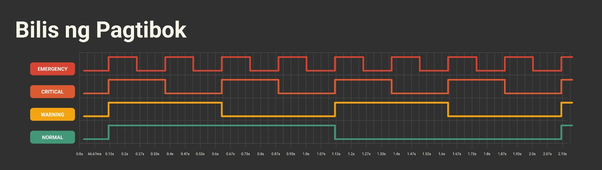

# 💡 Konsepto at Disenyo ng `LundayTibokAkl` v2.1.1

Ang konsepto ng pagtibok sa **LundayTibokAkl** ay isang sistema ng alerto na
sumusunod sa pamantayang [IEC 60073:2002](https://webstore.iec.ch/en/publication/587), na nagtatakda ng iba't ibang antas ng
pagtibok upang ipahiwatig ang antas ng alerto ng isang sistema. Sa
pamamagitan ng sistematikong pagsindi (on) at pagpindi (off) ng isang indikador,
tulad ng ilaw, buzzer, o vibration motor, maaaring maipabatid ang mahahalagang
impormasyon nang hindi kinakailangang gumamit ng pasulat o pasalitang
komunikasyon.

## Layunin

Ang pangunahing layunin ng aklatang ito ay magbigay ng abstraction para sa mga sumusunod:

- Pagpapatakbo ng mga indikador pang-istatus tulad ng LED, buzzer, o vibrating motors na may iba't ibang tibok

- Estandardisadong pattern ng pagtibok na sumusunod sa antas ng alerto

- Suporta sa PWM para sa kontroladong intensidad ng signal tulad ng tingkad ng ilaw o lakas ng tunog

- Modular na disenyo para sa madaling pagpapalawak at pagsasama sa iba pang sistema

## Disenyo at Arkitektura

### Pagtibok bilang *Pulse Signal*

Sa teknikal na antas, ang pagtibok ay isang *pulse wave*, isang uri ng signal sa
larangan ng elektronika at pagpoproseso ng signal. Ito ay maaaring irepresenta
bilang isang *square wave*, kung saan may dalawang estado:

- **SINDI (ON)**
- **PINDI (OFF)**

### Pagtutugma sa Pamantayang IEC 60073:2002

Ang bawat siklo ng pagtibok ay may tagal (*duration*), kung saan ang haba ng
estadong SINDI at PINDI ay tinutukoy ng agwat ng pagtibok. Sa
**LundayTibokAkl**, ito ay tinakda sa sumusunod na mga halaga:

| Antas ng Pagtibok | Antas ng Alerto (*IEC 60073:2002*) | Agwat (sa milisegundo) (SINDI/PINDI) | Dalasan (sa Hz) | Kahulugan |
| :-- | :-- | :--: | :-- | :-- |
| `EMERGENCY` | **EMERGENCY** | 125ms / 125ms | 4 Hz | Malubhang kagipitan |
| `CRITICAL` | **CRITICAL** | 250ms / 250ms | 2 Hz | Kritikal na babala |
| `WARNING` | **WARNING** | 500ms / 500ms | 1 Hz | Karaniwang babala |
| `NORMAL` | **NORMAL** | 1s / 1s | 0.5 Hz | Karaniwang operasyon |
| `DISABLED` | ~ | Walang pagtibok | ~ | Hindi pinagana |


<center>



</center>

Makikita sa larawan na habang tumataas ang antas ng alerto (*NORMAL* patungo sa
*EMERGENCY*), bumibilis ang pagtibok ng indikador. Katulad nito ang paraan kung
paano ginagamit ang tunog sa alarma at ilaw panghudyat sa industriya at
transoprtasyon.

Sa pamamagitan ng pagsunod sa pamantayang ito, mas madaling unawain ang mga
alerto sa anumang embedded system.

### Matematika ng Pagtibok

Ang *dalasan* ($f$) ng pagtibok ay kabaligtaran ng *puktol* ($T$) nito:

$$ f = \frac{1}{T} $$

kung saan:
- $f =$ Dalas ng pagsiklo sa Hertz (**Hz**), o ilang beses na nagsindi at nagpindi sa loob ng isang segundo.
- $T =$ Tagal ng isang buong siklo (*SINDI* + *PINDI*) sa segundo (**s**)

> Halimbawa, para sa **EMERGENCY mode**:
>
> $$ T = 0.25\text{s } ( 125 \text{ms SINDI } + 125 \text{ms PINDI} ) $$
>
> $$ f = \frac{1}{0.25} = 4 \text{ Hz} $$
>
> Nangangahulugan ito na ang indikador ay titibok ng **apat na beses bawat segundo**.

### Estruktura ng Klase

Ang `LundayTibok` ay ang pangunahing klase ng aklatan, na may mga sumusunod na bahagi:

- **Mga Enum:**

    - `HeartbeatLevel` – Naglalaman ng limang pattern ng tibok  (`EMERGENCY`, `CRITICAL`, `WARNING`, `NORMAL`, at `DISABLED`)

- **Mga Data Member:**

    - `_indicatorPin` – GPIO pin para sa indikador

    - `_interval` – Tagal ng pagitan ng tibok (milliseconds)

    - `_lastToggleTime` – Timestamp ng huling pagbabago ng estado

    - `_indicatorState` – Kasalukuyang estado ng output

    - `_activeHigh` – Boolean, tumutukoy kung HIGH ang aktibong signal

    - `_usePWM` – Boolean, tumutukoy kung gumagamit ng PWM

    - `_intensity` – Antas ng intensidad kapag naka-PWM

    - `_isDisabled` – Boolean, tumutukoy kung hindi pinagana ang pagtibok

- **Mga Pangunahing Metodo:**

    - `begin(bool activeHigh = true)` – Pagsisimula ng klase at pagsasaayos ng GPIO

    - `update()` – Pangunahing loop function upang pamahalaan ang tibok

    - `setHeartbeatLevel(HeartbeatLevel level)` – Pagbabago ng pattern ng pagtibok

    - `setPWM(int intensity)` – Pagtatakda ng liwanag para sa PWM

    - `disable()` – Pagpapatigil sa tibok

    - `enable()` – Pagpapagana muli sa tibok

    - `getHeartbeatLevel()` – Pagkuha ng kasalukuyang antas bilang teksto

## Implementasyon sa Kodigo

Sa klase ng `LundayTibok`, ang pagtibok ay ipinatutupad gamit ang `millis()`
upang subaybayan ang oras at awtomatikong baguhin ang estado ng indikador sa
tamang oras. Ito ay isang non-blocking na paraan upang paganahin ang indikador
na tumitibok nang hindi naaantala ang iba pang operasyon sa algoritmo.

### a) Pagsisimula ng Objek

Kapag lumikha tayo ng isang objek na **LundayTibok**, kailangan nating tukuyin ang :

- `indicatorPin` → Saan nakakabit ang indikador
- `level` → Antas ng pagtibok
- `usePWM` → Gagamitin ba ang PWM? (pinatakda: `false`)

``` cpp
LundayTibok tibok(13, WARNING, true);
```

Ang halimbawa sa itaas ay gagamit ng indikador sa pin 13, na may WARNING level
(1 Hz, ibig sabihin ay 500ms SINDI, 500ms PINDI), at may suportang PWM para sa
intensidad.

### b) Pagsisimula ng indikador sa `begin()`

Kapag tinawag ang `begin()`, itatakda nito ang indikador (hal., LED) bilang output at magpipindi (off) muna ito.

``` cpp
void LundayTibok::begin(bool activeHigh) {
    _activeHigh = activeHigh;
    pinMode(_indicatorPin, OUTPUT);
    digitalWrite(_indicatorPin, _activeHigh ? LOW : HIGH);
}
```

Kung `activeHigh = true`, ang indikador ay magsisindi sa HIGH at magpipindi sa LOW. Kung `false`, kabaligtaran ang mangyayari.

### c) Patuloy na Pagtibok sa `update()`

Ang `update()` function ang nagpapanatili sa indikador na tumibok nang tama.

1. Kunin ang kasalukuyang oras gamit ang `millis()`.

2. Kung lumipas na ang itinakdang oras (`_interval`), baligtarin ang estado ng indikador.

3. Ipatupad ang pagbabago gamit ang `digitalWrite()`, o `analogWrite()` (kung may PWM).

``` cpp
void LundayTibok::update() {
    if (_isDisabled) return;

    unsigned long currentMillis = millis();
    if (currentMillis - _lastToggleTime >= static_cast<unsigned long>(_interval)) {
        _lastToggleTime = currentMillis;
        _indicatorState = !_indicatorState;

        if (_usePWM) {
            analogWrite(_indicatorPin, _indicatorState ? _intensity : 0);
        } else {
            digitalWrite(_indicatorPin, _indicatorState == _activeHigh ? HIGH : LOW);
        }
    }
}
```

Sa bawat `loop()`, sinusuri nito kung dapat nang baguhin ang estado ng
indikador. Ginagamit nito ang `millis()` sa halip na `delay()` upang hindi
maantala ang ibang proseso.

### d) Pagtatakda ng Antas ng Pagtibok sa `setHeartbeatLevel()`

Maaaring baguhin ang antas ng pagtibok kahit nasa runtime.

``` cpp
void LundayTibok::setHeartbeatLevel(HeartbeatLevel level) {
    if (level != EMERGENCY && level != CRITICAL && level != WARNING && level != NORMAL && level != DISABLED) {
        Serial.println("[BALA] Maling `HeartbeatLevel`! Hindi ito itatakda.");
        return;
    }
    _interval = level;
}
```

Kung maling `level` ang ginamit, maglalabas ito ng mensahe sa Serial Monitor at hindi babaguhin ang kaayusan.

### e) PWM Control gamit ang `setPWM()`

Kung gumagamit ng PWM, maaari nating itakda ang intensidad ng indikador mula `0` (pindi) hanggang `255` (pinakamatindi).

```cpp
void LundayTibok::setPWM(int intensity) {
    if (!_usePWM) {
        Serial.println("[BALA] Ang PWM ay hindi pinagana! Hindi puwedeng magtakda ng intensidad.");
        return; 
    }
    _intensity = constrain(intensity, 0, 255);
}
```

Kung hindi pinagana ang PWM, magpapadala ito ng babala at hindi magpapatuloy.

### f) Pagpapagana at Di-pagpapagana ng Indikador

Maaaring pansamantalang ipindi (off) ang indikador gamit ang `disable()`, at ibalik ito gamit ang `enable()`.

``` cpp
void LundayTibok::disable() {
    _isDisabled = true;
    digitalWrite(_indicatorPin, _activeHigh ? LOW : HIGH);
}

void LundayTibok::enable() {
    _isDisabled = false;
}
```

Kapag di-pinagana, titigil ang indikador sa pagtibok at mananatiling PINDI (OFF).

### g) Pagsusuri ng Kasalukuyang Antas

Kung nais nating malaman kung anong antas ng pagtibok ang aktibo, maaari nating gamitin ang `getHeartbeatLevel()`.

``` cpp
const char* LundayTibok::getHeartbeatLevel() const {
    switch (_interval) {
        case EMERGENCY: return "KAGIPITAN";
        case CRITICAL: return "KRITIKAL";
        case WARNING: return "BABALA";
        case NORMAL: return "KARANIWAN";
        case DISABLED: return "HINDI AKTIBO";
        default: return "DI-BATID";
    }
}
```

Ipapakita nito ang pangalan ng kasalukuyang antas bilang string, kaya madali itong gamitin sa debugging.

## Paano Ito Gamitin?

Tingnan ang mga halimbawa [dito](../examples/)
